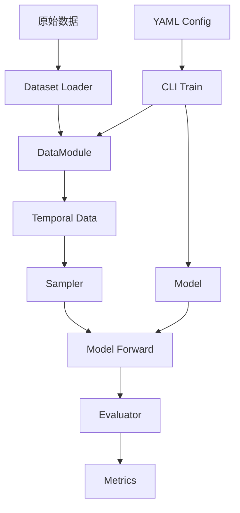

# TGX 项目架构文档

本文档详细介绍 TGX (Temporal Graph Learning) 项目的整体架构和各模块功能。

## 项目整体结构

```
GraphX-Temporal/
├── tgx/                                    # 核心时序图学习库 (v0.1.0 alpha)
│   ├── data/                               # 时序图数据结构与处理
│   │   ├── __init__.py
│   │   ├── temporal_data.py                # 核心时序图数据容器 Data 类
│   │   ├── datamodules/                    # PyTorch Lightning 数据模块
│   │   │   ├── __init__.py
│   │   │   ├── link_pred.py                # 链接预测数据模块
│   │   │   └── link_cls.py                 # 链接分类数据模块
│   │   └── __init__.py
│   ├── dataset/                            # 数据集加载器
│   │   ├── __init__.py
│   │   ├── temporal_dataset.py             # 时序数据集基类
│   │   ├── lp.py                           # 链接预测数据集
│   │   └── lc.py                           # 链接分类数据集
│   ├── models/                             # 模型基础架构
│   │   ├── __init__.py
│   │   ├── temporal_model.py               # TemporalModel 抽象基类
│   │   ├── temporal_evaluator.py           # 时序评估器基类
│   │   └── evaluators/                     # 任务特定评估器
│   │       ├── __init__.py
│   │       ├── link_pred.py                # 链接预测评估器
│   │       ├── link_cls.py                 # 链接分类评估器
│   │       └── node_cls.py                 # 节点分类评估器
│   ├── baselines/                          # 基准模型实现
│   │   ├── __init__.py
│   │   ├── simple/                         # 静态 GNN 基准
│   │   │   ├── __init__.py
│   │   │   └── arch.py                     # SimpleGNN 架构
│   │   ├── tgat/                           # TGAT 集成版本
│   │   │   ├── __init__.py
│   │   │   └── arch/
│   │   │       ├── __init__.py
│   │   │       ├── model.py                # TGAT 模型实现
│   │   │       └── tagt.py                 # TAGT 时间感知组件
│   │   └── cl_ond/                         # CL-OND 模型
│   │       ├── __init__.py
│   │       ├── arch.py                     # CL-OND 架构
│   │       ├── data.py                     # 数据处理
│   │       └── run_all.py                  # 运行脚本
│   ├── nn/                                 # 神经网络模块
│   │   └── tgat.py                         # TGAT 神经网络层
│   ├── sampling/                           # 采样策略
│   │   ├── __init__.py
│   │   ├── edge_sampler.py                 # 边采样器
│   │   ├── neighbor_sampler.py             # 邻居采样器
│   │   └── snapshot.py                     # 快照采样
│   ├── cli/                                # 命令行接口
│   │   ├── __init__.py
│   │   └── train.py                        # 统一训练脚本
│   ├── utils/                              # 工具函数
│   │   ├── __init__.py
│   │   ├── typing.py                       # 类型定义
│   │   ├── functions.py                    # 通用函数
│   │   └── metrics.py                      # 评估指标
│   └── __init__.py
├── docs/                                   # 项目文档
│   ├── modules.md                          # 本架构文档
│   └── ...
├── test/                                   # 测试代码
└── setup.py                                # 包配置文件
```

## 核心模块详解

### 1. 数据模块 (tgx/data/ & tgx/dataset/)

#### Data 类 (`temporal_data.py`)
核心时序图数据容器，提供统一的数据接口：

**主要属性**：
- `sources`: 源节点索引数组 (np.ndarray)
- `destinations`: 目标节点索引数组 (np.ndarray)
- `timestamps`: 边的时间戳数组 (np.ndarray)
- `edge_idx`: 边索引 (可选)
- `labels`: 边标签 (可选)
- `edge_feats`: 边特征 (可选)
- `node_feats`: 节点特征 (可选)

**核心方法**：
- `__len__()`: 返回边数量
- 自动计算 `num_edges` 和 `num_nodes`

#### 数据模块层次结构
- **LPDataModule** (`datamodules/link_pred.py`):
  - 专门处理链接预测任务
  - 支持 inductive 设置：`["new_old", "old_new", "new_new"]`
  - 集成负采样和 train/val/test 分割

- **LCDataModule** (`datamodules/link_cls.py`):
  - 专门处理链接分类任务
  - 处理边级别的分类标签

#### 数据集加载器 (`dataset/`)
- **LPDatasetLoader** (`lp.py`): 链接预测数据集加载
- **LCDatasetLoader** (`lc.py`): 链接分类数据集加载
- **TemporalDataset** (`temporal_dataset.py`): 时序数据集基类

### 2. 模型架构 (tgx/models/)

#### TemporalModel 基类 (`temporal_model.py`)
抽象基类，集成 PyTorch Lightning：

**核心特性**：
- 继承 `LightningModule` 和 `ABC`
- 统一的训练、验证、测试流程
- 任务特定评估器集成
- 自动化超参数保存和日志记录

**抽象方法**：
- `forward(batch: Data) -> ModelOutputs`: 前向传播
- `compute_loss()`: 损失计算

**关键属性**：
- `learning_rate`: 学习率
- `weight_decay`: 权重衰减
- `evaluator`: 任务特定评估器

#### 评估器系统
- **TemporalEvaluator**: 评估器基类
- **DummyEvaluator**: 空评估器
- **LinkPredEvaluator**: 链接预测评估器
- **LinkClsEvaluator**: 链接分类评估器
- **NodeClsEvaluator**: 节点分类评估器

### 3. 基准模型实现 (tgx/baselines/)

#### SimpleGNN (`simple/arch.py`)
静态图神经网络基准：
- **支持架构**: GCN, GAT, GraphSAGE + MLP
- **特点**: 忽略时序信息，仅使用静态图结构
- **配置文件**: `gcn-mooc-lp.yaml`, `mlp-mooc-lc.yaml`

#### TGAT 集成版本 (`tgat/`)
时间感知图注意力网络：
- **model.py**: 主模型架构
- **tagt.py**: 时间感知组件 (TAGT)
- **特点**: 时间编码 + 注意力机制

#### CL-OND (`cl_ond/`)
A contrastive learning strategy for optimizing node non-alignment in dynamic community detection (Neur. Compt. 2025)：
- **arch.py**: 核心架构实现
- **data.py**: 数据处理
- **配置**: `mooc-lc.yaml`, `mooc-lp-inductive.yaml`

### 4. 采样模块 (tgx/sampling/)

#### 边采样
- **edge_sampler.py**: 随机边采样策略
- 用途：训练批次采样，正负样本平衡

#### 邻居采样
- **neighbor_sampler.py**: 时序邻居采样
- 特点：考虑时间顺序的动态图消息传递

#### 快照采样
- **snapshot.py**: 时序图快照采样
- 用途：将连续时序图离散化为快照序列

### 5. 神经网络模块 (tgx/nn/)

- **tgat.py**: TGAT 专用神经网络层
- 时间感知的注意力机制实现
- 与 PyTorch Geometric 集成

### 6. 工具模块 (tgx/utils/)

#### 类型系统 (`typing.py`)
- **ModelOutputs**: 模型输出类型定义
- **DynamicGNNProtocal**: 动态 GNN 协议接口
- 完整的类型提示支持

#### 评估指标 (`metrics.py`)
- 时序图学习专用评估指标
- 链接预测、分类任务指标

#### 通用函数 (`functions.py`)
- 数据预处理工具
- 数值计算辅助函数

### 7. 命令行接口 (tgx/cli/)

#### 统一训练脚本 (`train.py`)
- **配置驱动**: 支持 YAML 配置文件
- **参数覆盖**: 命令行参数可覆盖配置文件
- **多任务支持**: 链接预测、链接分类、节点分类

**使用示例**：
```bash
# 使用配置文件
python -m tgx.cli.train --config tgx/baselines/simple/gcn-mooc-lp.yaml

# 使用 CL-OND 模型
python -m tgx.cli.train --config tgx/baselines/cl_ond/mooc-lc.yaml
```

## 架构设计原则

### 1. 抽象基类模式
- **统一接口**: 所有模型继承 `TemporalModel`
- **多态支持**: 运行时选择不同实现
- **代码复用**: 公共逻辑在基类实现

### 2. 任务特定设计
- **评估器工厂**: 根据任务自动选择评估器
- **数据模块**: LP/LC 任务专用数据处理
- **灵活配置**: 支持任务特定超参数

### 3. PyTorch Lightning 集成
- **简化训练**: 自动处理训练循环
- **硬件加速**: GPU 支持和多 GPU 训练
- **实验管理**: 日志记录和检查点

### 4. 模块化与可扩展性
- **松耦合**: 模块间通过明确接口交互
- **可插拔**: 采样器、评估器可独立替换
- **标准化**: 统一的数据格式和模型接口

## 数据流架构



## 扩展指南

### 添加新模型
1. 继承 `TemporalModel` 基类
2. 实现抽象方法：`forward()` 和 `compute_loss()`
3. 配置评估器和超参数
4. 创建 YAML 配置文件

### 添加新任务
1. 在 `evaluators/` 添加任务特定评估器
2. 实现对应的数据模块 (`datamodules/`)
3. 扩展类型定义 (`typing.py`)
4. 更新评估指标 (`metrics.py`)

### 添加新数据集
1. 确保符合 benchtemp 数据格式
2. 在 `dataset/` 添加专用加载器
3. 更新数据统计信息
4. 创建对应的配置文件

## 配置系统

### YAML 配置结构
```yaml
model:
  class_path: tgx.baselines.simple.arch.LPGNN
  init_args:
    # 模型参数

data:
  class_path: tgx.data.LPDataModule
  init_args:
    # 数据参数

trainer:
  # 训练器参数
```

### 配置优先级
1. 命令行参数 (最高)
2. YAML 配置文件
3. 默认值 (最低)
